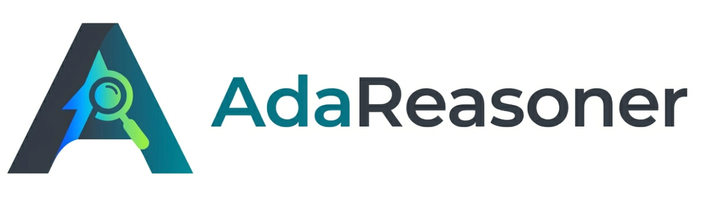
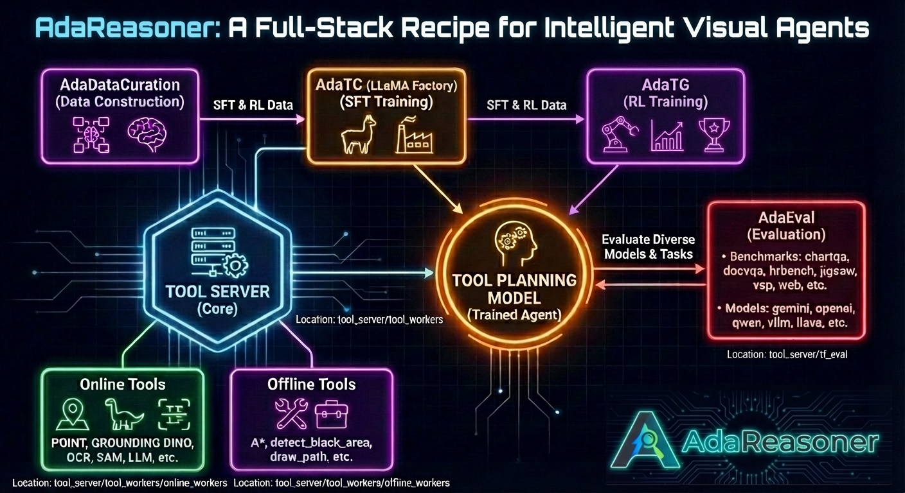

<div align="center">
  
  <h1 align="center">Dynamic Tool Orchestration for Iterative Visual Reasoning</h1>

  <a href="#">
    
  </a>
  <a href="https://github.com/ssmisya/AdaReasoner/tree/main/docs">
    
  </a>
  <a href="https://huggingface.co/collections/hitsmy/adareasoner">
    
  </a>
  <a href="https://adareasoner.github.io">
    
  </a>

  <a href="https://github.com/ssmisya/AdaReasoner/tree/main/tool_server/tf_eval/demo">
  
  </a>
  <a href="https://youtu.be/_SOyD-lomOM">
    
  </a>
    
</div>


<div align="center">
  
  <br>
  <em>Overview of the AdaReasoner framework.</em>
</div>

<div align="center">
  <h3>🎬 Demo Video</h3>
  <a href="https://youtu.be/_SOyD-lomOM">
    
  </a>
  <br>
  <a href="https://youtu.be/_SOyD-lomOM">
    
  </a>
</div>

## 🧩 Project Architecture Overview
| **Module Name** | **Functionality** | **Location** | **Dependency** |
|---|---|---|---|
| **Tool Server** | Supports both online and offline tools and serves as the core of all components.| [`tool_server/tool_workers/`](./tool_server/tool_workers/) | [`tool-server`](#️-installation) |
| **AdaTC** | Performs Tool Cold Start (TC, SFT) of tool planning models, concretely, we are using LLaMA Factory as our backbone. | [LLaMA Factory](https://github.com/hiyouga/LLaMA-Factory) |[LLaMA Factory](https://github.com/hiyouga/LLaMA-Factory) |
| **AdaTG** | Performs Tool GRPO (TG, RL) with tool interaction. | [`AdaTG`](./AdaTG) | [`adatg`](./AdaTG) |
| **AdaEval** | An evaluation framework that supports any combinations of models and tasks for tool planning evaluation. | [`tool_server/tf_eval/`](./tool_server/tf_eval/) |[`tool-server`](#️-installation) |
| **AdaDataCuration** | Constructs data for SFT (TC), RL (TG), and evaluation (AdaEval). | [`tool_server/ada_data_curation/`](./tool_server/ada_data_curation/) | TBD |

---


## News
<!-- - **[2026/01]** AdaReasoner paper is now available on [arXiv](#). -->
- **[2026/01/27]** AdaReasoner paper is now available on [arXiv](https://arxiv.org/abs/2601.18631).
- **[2026/01/26]** 🎉🎉 An alternative version of our work has been accepted to **ICLR 2026**. See you in Rio!
- **[2026/01/17]** The models and datasets are released on [HuggingFace](https://huggingface.co/AdaReasoner).
- **[2026/01/17]** AdaReasoner Framework codebase is released. Try it out!


## 🚀 Quick Start
This framework comprises three main components: the fundamental tool service supplier ``tool_server``, the inference evaluation framework `AdaEval`, and the RL work ``AdaRL``. Each component has its own environment requirements. The `tool_server` serves as the foundation and must be successfully launched before performing any inference or training.

### 🖥️ Prerequisite: Launch Tool Server
The Tool Server provides two types of tools.
**Online tools** mainly offer compute-intensive functionalities and need to be deployed on GPU servers. In contrast, **offline tools** provide lightweight utilities that do not require GPU resources and can be executed efficiently on CPUs.
If you only need offline tools, you can simply install the environment without running the Tool Server.

### 🛠️ Installation
First of all, provide a pytorch-based environment.

```bash
# [Optional] Create a clean Conda environment
conda create -n tool-server python=3.10
conda activate tool-server
# Install PyTorch or prepare a torch-based environment
pip install torch==2.6.0 torchvision==0.21.0 torchaudio==2.6.0 --index-url https://download.pytorch.org/whl/cu124

# Install this project
git clone https://github.com/ssmisya/AdaReasoner.git
# You can reference our requirements.txt for other dependencies
pip install -r AdaReasoner/requirements/requirements.txt 
pip install -e AdaReasoner # We didn't add too many constraints for easier installation

```
⚠️ **Be aware:**

We **deliberately selected minimal dependencies** in this project to reduce the risk of conflicts. As a result, you may need to manually install any missing packages based on your environment.

#### Option 2.1 Start Tool Server through SLURM
It's recommended to start the tool server through SLURM because it's more flexible.
```bash
## First, modify the config to adapt to your own environment
## AdaReasoner/tool_server/tool_workers/scripts/launch_scripts/config/all_service_example.yaml

## Start all services
cd AdaReasoner/tool_server/tool_workers/scripts/launch_scripts
python start_server_config.py --config ./config/all_service_example.yaml

## Press Ctrl + C to shutdown all services automatically.
```

#### Option 2.2 Start Tool Server Locally
We made a slight modification to ``start_server_config.py`` to create ``start_server_local.py``, primarily by removing the logic related to SLURM job detection and adapting it for local execution instead.
```bash
## First, modify the config to adapt to your own environment
## AdaReasoner/tool_server/tool_workers/scripts/launch_scripts/config/all_service_example_local.yaml

## Start all services
cd AdaReasoner/tool_server/tool_workers/scripts/launch_scripts
python start_server_local.py --config ./config/all_service_example_local.yaml

## Press Ctrl + C to shutdown all services automatically.
```

You can then inspect the log files to diagnose and resolve any potential issues. Due to the complexity of this project, we cannot guarantee that it will run without errors on every machine.


## 🔍 Usage1: Run Evaluation with AdaEval

### 🛠️ Installation
This environment is the same with tool-server, first of all, provide a pytorch-vllm-based environment.
* vllm>=0.7.3
* torch>=2.5.1
* transformers>=4.49.0
* flash_attn>=2.7.3

```bash
# [Optional] Create a clean Conda environment
conda create -n vllm python=3.10
conda activate tool-server

# Install this project
git clone https://github.com/ssmisya/AdaReasoner.git
pip install -r AdaReasoner/requirements/inference_requirements.txt # Tool Server Requirements
pip install -e AdaReasoner

```

#### ✅ Option 1: Direct Evaluation (e.g., Qwen2VL on ChartGemma)

```bash
accelerate launch  --config_file  ${accelerate_config} \
-m tool_server.tf_eval \
--model qwen2vl \
--model_args pretrained=Qwen/Qwen2-VL-7B-Instruct \
--task_name chartgemma \
--verbosity INFO \
--output_path ./tool_server/tf_eval/scripts/logs/results/chartgemma/qwen2vl.jsonl \
--batch_size 2 \
--max_rounds 3 \
```

#### 🧩 Option 2: Evaluation via Config File (Recommended)


```bash
accelerate launch  --config_file  ${accelerate_config} \
-m tool_server.tf_eval \
--config ${config_file}
```

#### Config file example:

```yaml
    - model_args:
    # The model series you want to test, must be the same with the file name under tf_eval/models
    model: vllm_models
    # The arguments to pass to the model, specify model path, tensor parallel size, and other parameters
    model_args: pretrained=/mnt/petrelfs/songmingyang/songmingyang/runs/tool_factory/sft/v1/Qwen2.5-VL-7B-Instruct-pathverify_v0,tensor_parallel=2,limit_mm_per_prompt=10
    # Batch size for inference. Adjust according to your GPU memory.
    batch_size: 50
    # Maximum number of rounds for tool-model interaction
    max_rounds: 6
    # Model operation mode
    model_mode: general
  task_args:
    # The task to evaluate (options include: chartgemma,chartqa,charxiv,docvqa,ocrbench,reachqa,vstar)
    task_name: vsp
    # Specific tools to use for evaluation, don't set this if you want all tools available.
    tool_selection: Point,Draw2DPath
    # Checkpoint to resume from, organized as task_name: path
    resume_from_ckpt:
      vsp: ./tool_server/tf_eval/scripts/logs/ckpt/frozen_lake/pathverify_v0_qwen25_7b/vsp.jsonl
    # Path to save checkpoint, organized as task_name: path
    save_to_ckpt:
      vsp: ./tool_server/tf_eval/scripts/logs/ckpt/frozen_lake/pathverify_v0_qwen25_7b/vsp.jsonl
    # Directory to save intermediate images generated during evaluation
    middle_images_save_dir:
      vsp: ./tool_server/tf_eval/scripts/logs/ckpt/frozen_lake/pathverify_v0_qwen25_7b/middle_images
  script_args:
    # Logging verbosity level
    verbosity: INFO
    # Path to save final evaluation results
    output_path: ./tool_server/tf_eval/scripts/logs/results/frozen_lake/pathverify_v0_qwen25_7b/qwen25_allres.jsonl
    # Whether to use tools during inference
    if_use_tool: True
```

For detailed information and config setting please refer to our [documentation](docs/README.md).


## Usage2: Run Tool Cold Start (TC, SFT) with AdaTC

Our SFT stage is implemented using [LLaMA Factoruy](https://github.com/hiyouga/LlamaFactory), which offers a stable and efficient training framework. We use the TC data on [LLaMA Factoruy](https://github.com/hiyouga/LlamaFactory) to obtain our SFT model.


## Usage3: Run Tool GRPO (TG, RL) with AdaTG

### Environment Setup

```bash
# [Optional] Create a clean Conda environment
conda create -n tool-server python=3.10
conda activate tool-server
# Install PyTorch or prepare a torch-based environment
pip install torch==2.6.0 torchvision==0.21.0 torchaudio==2.6.0 --index-url https://download.pytorch.org/whl/cu124


# Install AdaTG
git clone https://github.com/ssmisya/AdaReasoner.git
cd AdaReasoner/AdaTG
# You can reference our requirements.txt for other dependencies
pip install -r ./requirements.txt 
pip install -e . # We didn't add too many constraints for easier installation
```

### Prepare Data & Reference Models
Please prepare your data in huggingface parquet format. The data format should follow:

```python
prompt = [
    {
        "content": system_prompt,
        "role": "system"
    },
    {
        "content": f"{question_text}",
        "role": "user"
    }
]
item = {
    "data_source": "jigsaw_coco",
    "prompt": prompt,
    "images": [{"bytes": question_image_bytes}] + choice_images,
    "ability": "visual_reasoning",
    "env_name": "jigsaw",
    "reward_model": {
        "ground_truth": correct_letter.lower(),
        "style": "model"
    },
    "extra_info": { # Used for reward calculation
        "extra_info1": "...",
    }
}

```
You can also refer to our [Data & Models](https://github.com/ssmisya/AdaReasoner/tree/main/docs/data_models.md) page for access to the provided datasets and pretrained models.

### Start Ray Cluster (Optional)

You can also start a Ray cluster to enable the dashboard and facilitate easier debugging.

```bash
ray start --head --port=$port --dashboard-host=0.0.0.0 \
--dashboard-port=$dashboard_port \
--ray-client-server-port=${client_server_port}  \
--num-cpus "64" \
--num-gpus "8"  \
--block --temp-dir="$TMPDIR" \
--min-worker-port ${min_worker_port} \
--max-worker-port ${max_worker_port}
```

### Start Training
> ⚠️ **Important:** Online tools require the **tool server** to be running.  
> Please start the tool server before invoking any online tools.

We recommend an 8×A100 GPU setup for training the 7B model.

```bash
python -m verl.trainer.main_ppo \
    --config-path . \
    --config-name unified \
    +debug=False \
    +vs_debug=False \
    data.train_files=[${FROZENLAKE_DATASET_TRAIN}] \
    data.val_files=[${FROZENLAKE_DATASET_VAL}] \
    data.train_batch_size=32 \
    data.max_prompt_length=8192 \
    data.max_response_length=20480 \
    data.return_raw_chat=True \
    data.filter_overlong_prompts=True \
    algorithm.adv_estimator=grpo \
    algorithm.kl_ctrl.kl_coef=0.0 \
    actor_rollout_ref.model.path=${REF_MODEL_PATH} \
    actor_rollout_ref.model.use_remove_padding=True \
    actor_rollout_ref.actor.optim.lr=1e-6 \
    actor_rollout_ref.actor.ppo_mini_batch_size=8 \
    actor_rollout_ref.actor.ppo_micro_batch_size_per_gpu=1 \
    actor_rollout_ref.actor.use_kl_loss=False \
    actor_rollout_ref.actor.kl_loss_coef=0.0 \
    actor_rollout_ref.actor.kl_loss_type=low_var_kl \
    actor_rollout_ref.actor.entropy_coeff=0.0 \
    actor_rollout_ref.actor.checkpoint.contents=['model','hf_model','optimizer','extra'] \
    actor_rollout_ref.actor.ulysses_sequence_parallel_size=1 \
    actor_rollout_ref.rollout.log_prob_micro_batch_size_per_gpu=8 \
    actor_rollout_ref.rollout.tensor_model_parallel_size=1 \
    actor_rollout_ref.rollout.name=vllm \
    actor_rollout_ref.rollout.n=4 \
    actor_rollout_ref.rollout.max_num_batched_tokens=32768 \
    actor_rollout_ref.rollout.gpu_memory_utilization=0.65 \
    actor_rollout_ref.rollout.enforce_eager=False \
    actor_rollout_ref.rollout.free_cache_engine=False \
    actor_rollout_ref.rollout.enable_chunked_prefill=False \
    actor_rollout_ref.actor.fsdp_config.param_offload=True \
    actor_rollout_ref.actor.fsdp_config.optimizer_offload=True \
    actor_rollout_ref.ref.log_prob_micro_batch_size_per_gpu=1 \
    actor_rollout_ref.ref.fsdp_config.param_offload=True \
    actor_rollout_ref.rollout.agent.activate_agent=True \
    actor_rollout_ref.rollout.agent.tool_name_key=env_name \
    actor_rollout_ref.rollout.agent.single_response_max_tokens=10240 \
    actor_rollout_ref.rollout.agent.max_turns=10 \
    actor_rollout_ref.rollout.agent.concurrent_workers=1 \
    actor_rollout_ref.rollout.agent.show_tqdm=True \
    trainer.critic_warmup=0 \
    trainer.logger=['console','wandb','rl_logging_board'] \
    trainer.val_before_train=True \
    trainer.n_gpus_per_node=8 \
    trainer.nnodes=1 \
    trainer.save_freq=50 \
    trainer.test_freq=10 \
    trainer.project_name=${PROJECT_NAME} \
    trainer.experiment_name=${EXPERIMENT_NAME} \
    trainer.max_actor_ckpt_to_keep=2 \
    trainer.max_critic_ckpt_to_keep=2 \
    trainer.default_local_dir=${SAVE_CHECKPOINT_DIR}/${PROJECT_NAME}/${EXPERIMENT_NAME} \
    trainer.resume_mode=auto \
    +trainer.tensorboard_dir=${SAVE_CHECKPOINT_DIR}/logs/tensorboard \
    +trainer.rl_logging_board_dir=${SAVE_CHECKPOINT_DIR}/logs/rl_logging_board \
    trainer.total_epochs=10 \
    actor_rollout_ref.rollout.agent.tool_manager.controller_addr=${controller_addr} \
    custom_reward_function.path=./verl/utils/reward_score/unified_tool.py \
    actor_rollout_ref.model.max_pixels=${MAX_PIXELS}
```

You can refer to `AdaReasoner/AdaTG/examples/adareasoner` for additional training and evaluation scripts.
A complete configuration example is provided in `AdaReasoner/AdaTG/examples/adareasoner/unified_randomize.yaml`.


## 📚 Citation
If you find this project useful in your research, please consider citing our paper:

```bibtex
@article{song2026adareasoner,
  title={AdaReasoner: Dynamic Tool Orchestration for Iterative Visual Reasoning},
  author={Song, Mingyang and Sun, Haoyu and Gu, Jiawei and Li, Linjie and Xu, Luxin and Krishna, Ranjay and Cheng, Yu},
  journal={arXiv preprint arXiv:2601.18631},
  year={2026}
}
```


